# Flutter Tailwind CSS Defaults

[Tailwind CSS](https://tailwindcss.com/) defaults for Flutter

## Colors

[Color](https://api.flutter.dev/flutter/dart-ui/Color-class.html) and [ColorSwatch](https://api.flutter.dev/flutter/painting/ColorSwatch-class.html) constants which represent [Tailwind CSS](https://tailwindcss.com/)'s default color palette.

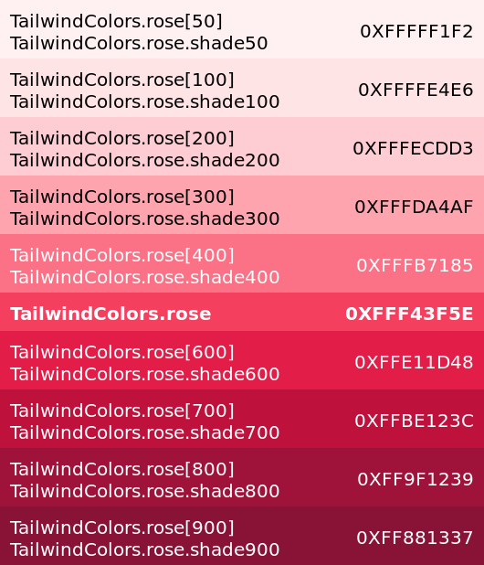

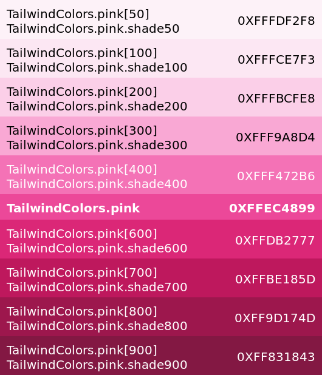

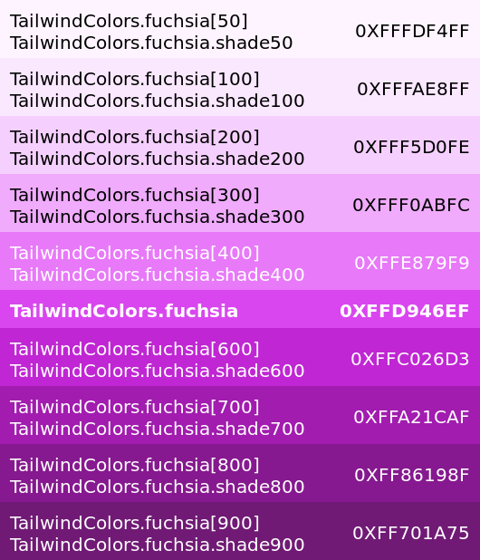

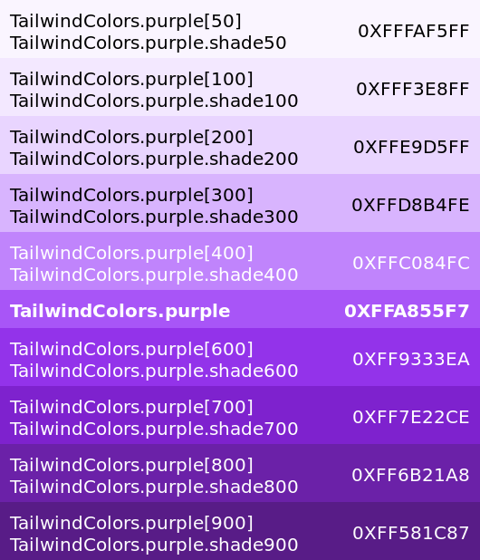

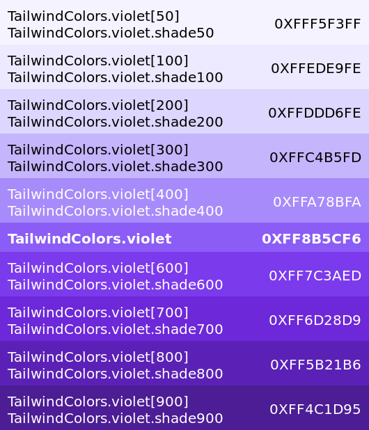

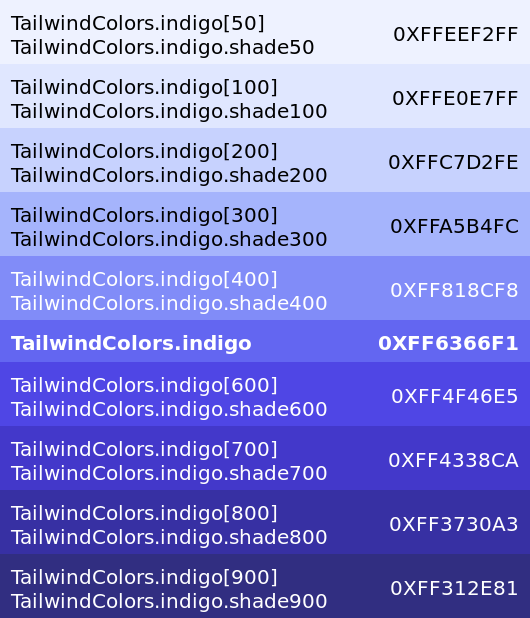

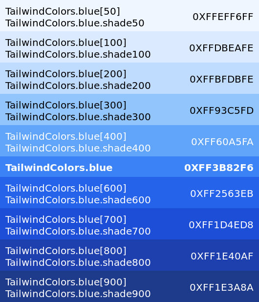

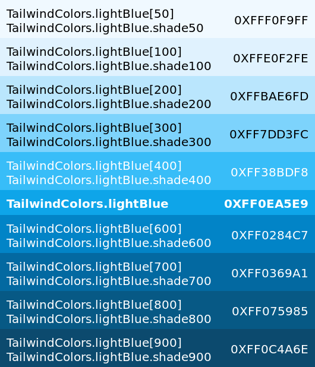

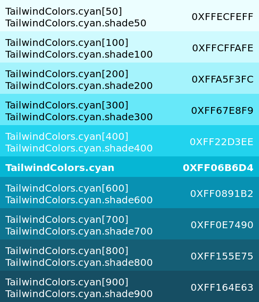

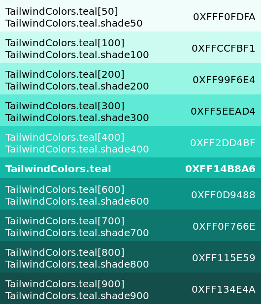

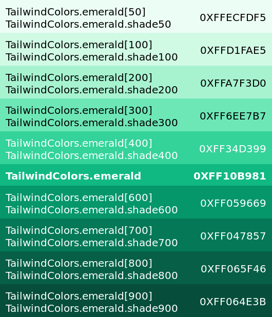

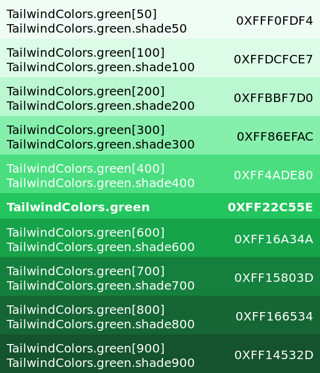

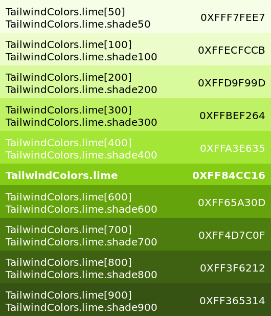

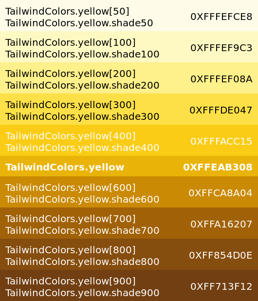

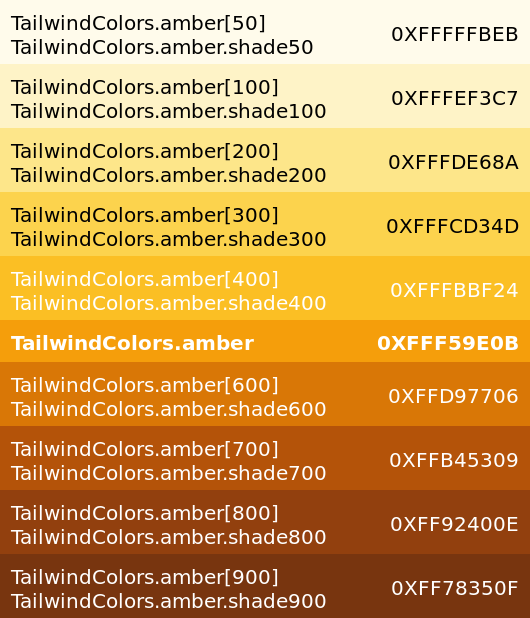

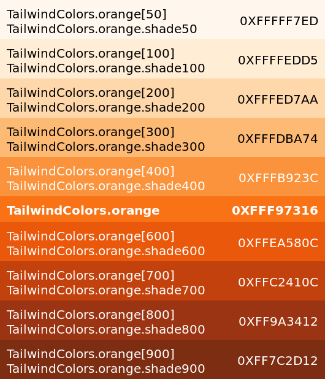

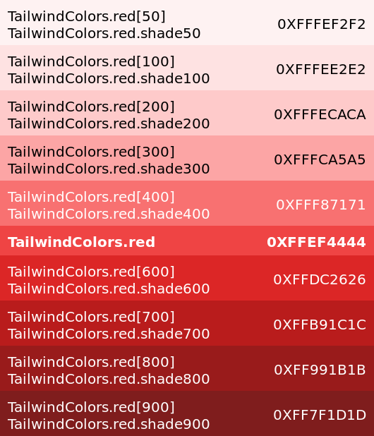

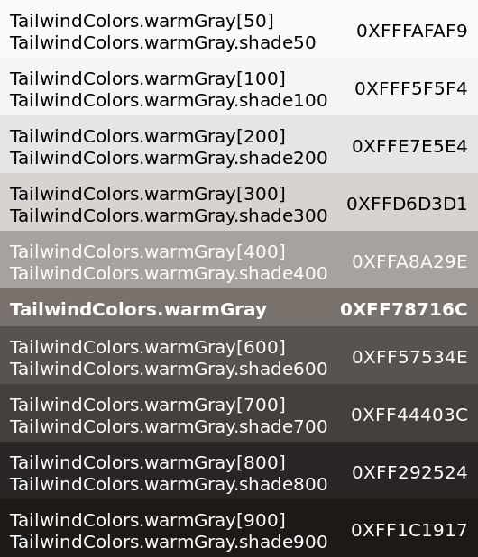

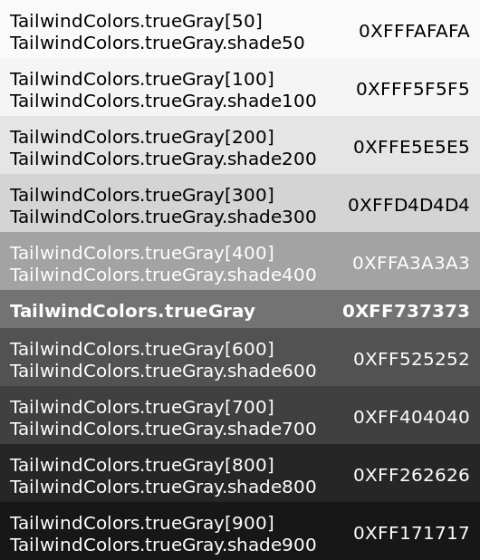

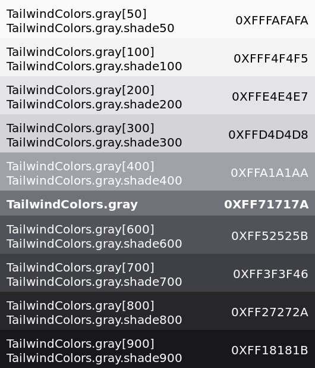

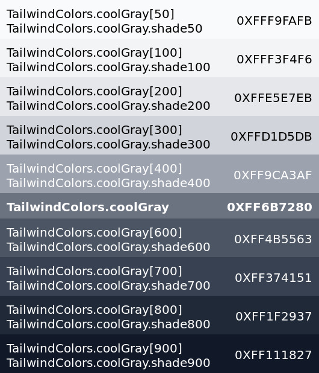

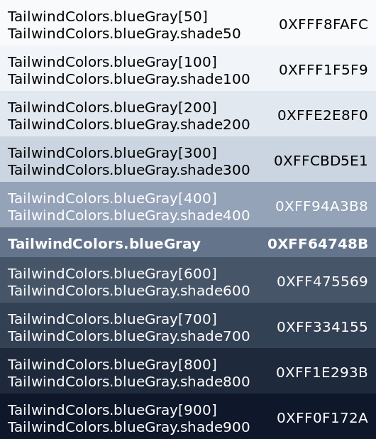

## Theme

[Tailwind CSS](https://tailwindcss.com/)'s default theme.

